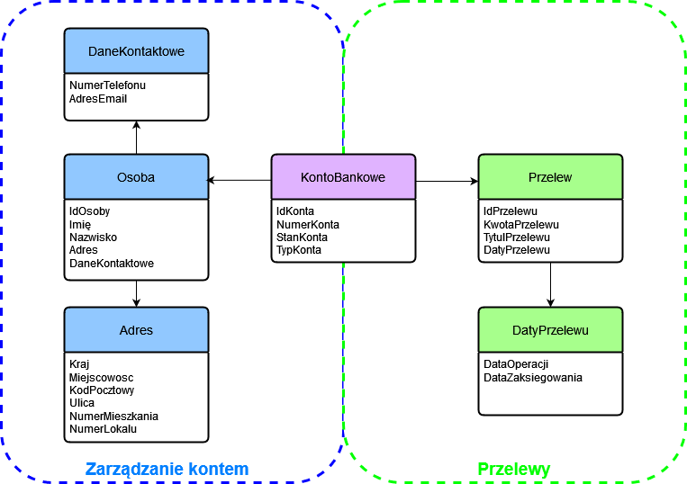

## Zadanie 1- Domain Driven Design

Celem zadania było zamodelowanie bezpiecznej aplikacji bankowej zgodnie z zasadami Domain Driven Design. W ramach realizacji zdefiniowane zostały dwa konteksty: *Zarządzanie kontem* oraz *Przelewy*. Zamodelowany został agregat *KontoBankowe* oraz encje *Osoba* i *Przelew*. Zdefiniowane zostały również obiekty wartości takie jak *DaneKontaktowe*,  *Adres* i *DatyPrzelewu*.

|Encja/Obiekt wartości|Atrybut                      |Akceptowane formaty danych                    |
|----------------|-------------------------------|-----------------------------|
|Osoba|idOsoby            | int, unikatowa liczba całkowita           |
|Osoba        |Imie           |     string, zawiera jedynie litery    |
|Osoba     |Nazwisko |string, zawiera jedynie litery, dopuszczalny jest znak "-"|
|Osoba     |Adres |VO|
|Osoba     |DaneKontaktowe |VO|
|DaneKontaktowe  |NumerTelefonu |int, liczba mająca dokładnie 9 cyfr |
|DaneKontaktowe  |AdresEmail |string, spełnia założenia adresu email, sprawdzane jest wystąpienie znaku "@" |
|Adres |Kraj |string, zawiera jedynie litery, dopuszczalny jest znak "-". Predefiniowana lista wyboru i walidacja na jej podstawie|
|Adres |Miejscowosc |string, zawiera jedynie litery, dopuszczalny znak "-" oraz \s|
|Adres |KodPocztowy |string, w formacie XX-XXX, gdzie X jest cyfrą|
|Adres |Ulica |string, zawiera litery, dopuszczalne cyfry|
|Adres |NumerMieszkania |string, zawiera litery, dopuszczalne cyfry|
|Adres |NumerLokalu |string, zawiera litery, dopuszczalne cyfry|
|KontoBankowe |IdKonta |int, unikatowa liczba całkowita         |
|KontoBankowe |NumerKonta |string, zawiera dokładnie 26 cyfr, unikatowy |
|KontoBankowe |StanKonta |float|
|KontoBankowe |TypKonta |string, predefiniowana lista wyboru i walidacja na jej podstawie|
|Przelew |IdPrzelewu |int, unikatowa liczba całkowita    |
|Przelew |KwotaPrzelewu |float|
|Przelew |TytulPrzelewu |string|
|Przelew |DatyPrzelewu |VO|
|DatyPrzelewu |DataOperacji |date, w formacie RRRR-MM-DD|
|DatyPrzelewu |DataZaksiegowania |date, w formacie RRRR-MM-DD|

