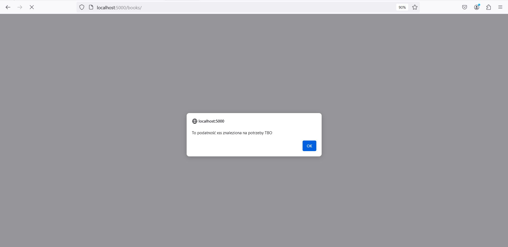
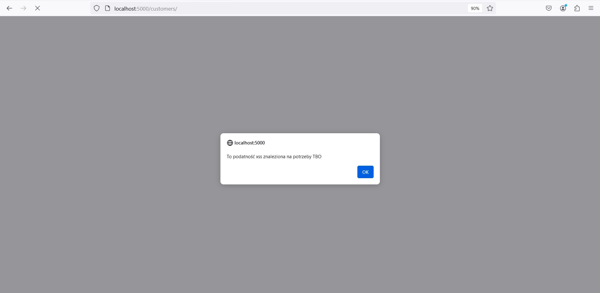

## Zadanie 2 - Weryfikacja danych wejściowych do aplikacji

W udostępnionej aplikacji znaleziona została podatność XSS
- W zakładce *Books* podczas dodawania nowej książki może zostać wstrzyknięty złośliwy kod. Można go wpisać zarówno w okienku do wpisania tytułu książki jak i autora. Co więcej złośliwy kod może zostać wstrzyknięty równieś podczas edycji istniejącej już pozycji.
- W zakładce *Customers* złośliwy kod może zostać wstrzyknięty podczas dodawania nowego klienta. Można go wpisać zarówno w okienku do wpisania imienia klienta jak i miejscowości. Podobnie jak w przypadku książek istnieje możliwość wstrzyknięcia złośliwego kodu podczas edycji istniejącej pozycji.

Na potrzeby udokumentowania wystąpienia podatności wykorzystany został złośliwy kod w postaci: 

``

W wyniku jego wpisania w wymienionewcześniej pola uzuskujemy następujący efekt dlazakladki *Books*:

oraz zakładki *Customers*

W celu zapobiegnięciu takiej sytuacji, dopisane zostały odpowiednie fragmenty kodu, które przy pomocy wyrażeń regularnych sprawdzają poprawność danych, a więc nie "przepuszczają" opcji wpisania takiego fragmentu złośliwego kodu.